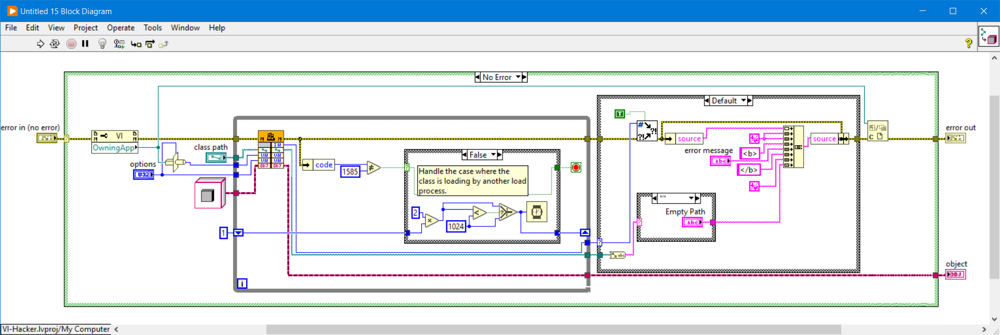

# LabVIEW-VI-Hacker
Unlocks password protected LabVIEW VIs

***Disclaimer: This is for demonstration purposes only, not to be used for malicious intent.***

*Note: This does not support VI's in LLB's, copy the VI out of the LLB first.*

## Getting Started

Open the `/src/Demo.vi`, enter a password protected VI Path (*that's not in an llb*).

Run the VI to unlock the password protected VI and preview the content in new VI.

*Note: The original VI remains unmodified.*

You are now able to see what's on the block diagram.


## Example

For example, run the `Demo.vi` for the locked `<vi.lib>\Utility\LVClass\Get LV Class Default Value.vi`:


to unlock and shows the block diagram content:



## How does it works?

This library uses a simplified variation of the [VI-Explorer-VI](https://github.com/tomsoftware/VI-Explorer-VI) brute force algorithm to calculate the MD5 password salt to regenerate and replace the Block Diagram Password (BDPW) block's MD5 password hashes.


The MD5 of the original password is concatenated with the owning libraries (LIBN) block (as colon delimited qualified library path) and LabVIEW Source (LVSR) block data.

The password salt is then calculated by brute force and checked against the first password hash (`Hash1`). 
Once the salt if found, the `BDPW.Password(MD5)` + `LIBN.QualifiedPath` + `LVSR.Content` + `Salt` are concatenated with the uncompressed block diagram heap (BDHc, BDHb, or BDHP) to generate the final hash (`Hash2`).
[ZLib](https://www.zlib.net/) is used to uncompress the block diagram heap (BDHc, BDHb) for the final password hash.


The Block Diagram Password (BDPW) block is then replaced within the VI file:

```
BDPW:
  Password (MD5) - 16 bytes
  Hash1 (MD5) - 16 bytes
  Hash2 (MD5) - 16 bytes
```


The VI is saved to a new path and loaded through the VI scripting template.

---

*For the data dorks, read on...*
 
## VI File Structure

A VI file is a resource binary file (RSRC) that contain “Identifiers" and “Blocks.” Identifiers are chunks of data within the file that hold position and metadata information about the Blocks.
Blocks are named data pairs that define the VI's functions & behaviours (Connector Pane, Front Panel, Block Diagram, Icons, etc.). 
Identifiers are positioned sequential at the end of the VI file but Blocks can vary in file offset position and order.
Similar to PNG images, Blocks have a 32-bit human readable ASCII string that define that chunk to data (‘LVSR’, ‘vers’, ‘ICON’, ‘BDHb’, ‘FPHb’).
Unlike PNG images, a Blocks identifier and data are located in different segments of the file and are referenced by relative byte offsets from the resource header definitions throughout the file.

### LabVIEW File Types

```
VI File (*.vi|*.vit|*.vim|*.ctl|*.ctt)

Bytes | Section       // Description
----------------------------------- 
   32 | RSRC_HEADER1  // First resource header
  x.. | BLOCK_DATA[]  // Data blocks (Positions determined by BLOCK_INFO)
   32 | RSRC_HEADER2  // Second resource header (duplicate of first)
   20 | RSRC_INFO     // Resource information packet
    4 | BLOCK_CNT     // Number of blocks (Add 1 to count)
 12*n | BLOCK_IDS[]   // Block identifiers (Array size: BLOCK_CNT + 1)
 20*n | BLOCK_INFO[]  // Block position information (Array size: BLOCK_CNT + 1)
  1*x | VI_NAME       // Qualified VI filename (1 byte length + string)
<End Of File>
```

### Order of operation

1. Read the RSRC_HEADER1 to determine the byte offset to RSRC_HEADER2
2. Read RSRC_HEADER2 and verify that RSRC_HEADER1 and RSRC_HEADER2 match (if not the file is corrupt)
3. Next read RSRC_INFO to determine the byte offset to BLOCK_CNT
4. For each block in BLOCK_CNT
5. Read the BLOCK_ID to get the block name and BLOCK_INFO byte offset
6. Read the BLOCK_INFO to determine the byte offset to BLOCK_DATA
7. Return the block name + position metadata
8. Map each block to content data position
9. Unflatten each block into LabVIEW Data Types

### Block Identifiers

Each block has 3 data chunk types: data, identity and information. This library does not parse the VI's binary data but instead keeps track of where each chunk of data is located in the file.
This makes it easier to manipulate the VI file inplace.
To distinguish between the data chunk types, this library appends the data chunk type with a 4-byte human readable type name:

- Block Data = `XXXX_DAT`
- Block Id = `XXXX_BID`
- Block Information = `XXXX_INF`

e.g. Block Diagram Password (BDPW) has: `BDPW_DAT`, `BDPW_BID` and `BDPW_INF` data chunks. LabVIEW Source (LVSR) is `LVSR_DAT`, `LVSR_BID` and `LVSR_INF`.

The resource headers, information and filename start with resource `RSRCxxxx` to ensure they don't conflict with other block names:

- RSRC Header = `RSRCHDR1` and `RSRCHDR2`
- RSRC Information = `RSRCINFO`
- RSRC Filename = `RSRCFNAM`
- Block Count = `RSRC_CNT`

This library maintains the raw VI binary content and create a metadata lookup table to map each data chunk with offset byte position, total byte size and byte size of the length prefix (some use I32 length preview, others life filename only use 1 byte for length).

### Credit

[VI-Explorer-VI](https://github.com/tomsoftware/VI-Explorer-VI) - Salt cracking [LICENSE](/docs/vi-exploer-vi_license.txt)

[ZLib](https://www.zlib.net/) - Uncompress block diagram heap [LICENSE](/docs/zlib_license.txt)

For more information on VI file format, check out my other post: [VI File Format](https://ryanpacini.com/posts/vifileformat/)
