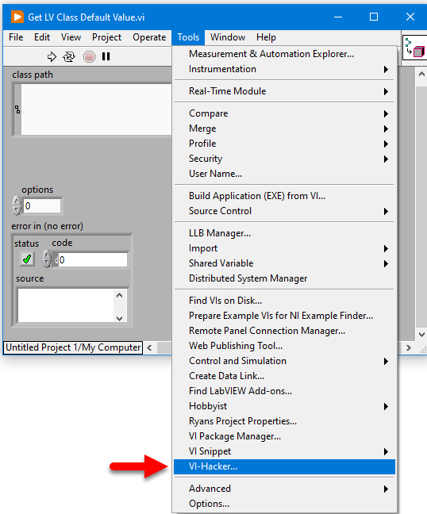

# Tools Menu - VI-Hacker

## Getting Started

Copy `VI-Hacker.vi` file and `_VI-Hacker` directory to `<LabVIEW>\project`

This adds a tool menu: `Tools > VI-Hacker...`

## Usage

When a password protected VI is encountered, open the VI then
select `Tools > VI-Hacker` to unlock and see the block diagram.

The VI content is copied to a new VI so the original file remains unmodified.

*Note: This does not work on VI files in LLBs.*

